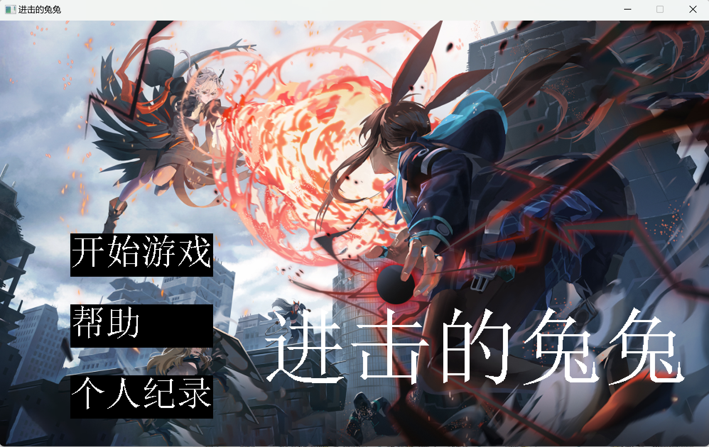
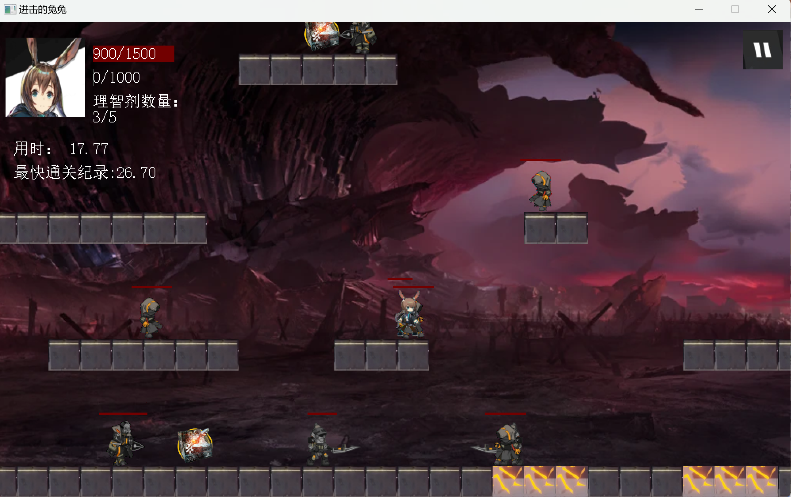
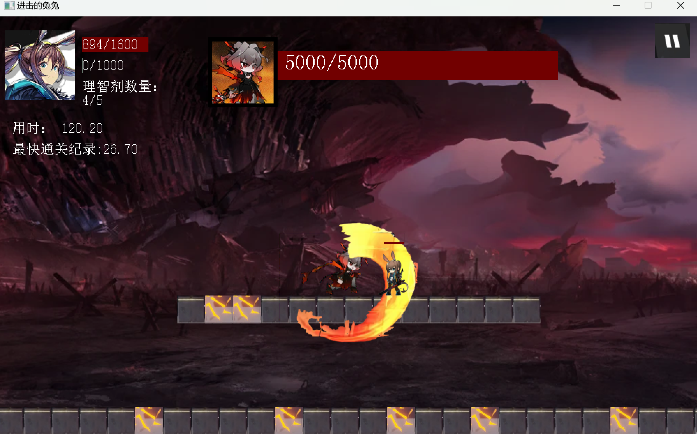

# 《进击的兔兔》
 
华南理工大学——大一下学期C++程序设计大作业

### 简要介绍
基于C++以及easyx图形库设计的一款横板闯关小游戏，游戏背景来源于手游《明日方舟》

### 文件说明
code文件夹中存储所有代码

code子文件夹resoure中存储游戏运行所需要的所有图片和音频

### 游戏截图
  主页：  

  
游戏画面：

  
 
### 操作指南
点击运行x64/release中的exe文件
 
### tips
说明文档详细说明了游戏设计框架以及重要函数的运行机制，仅用于交流学习